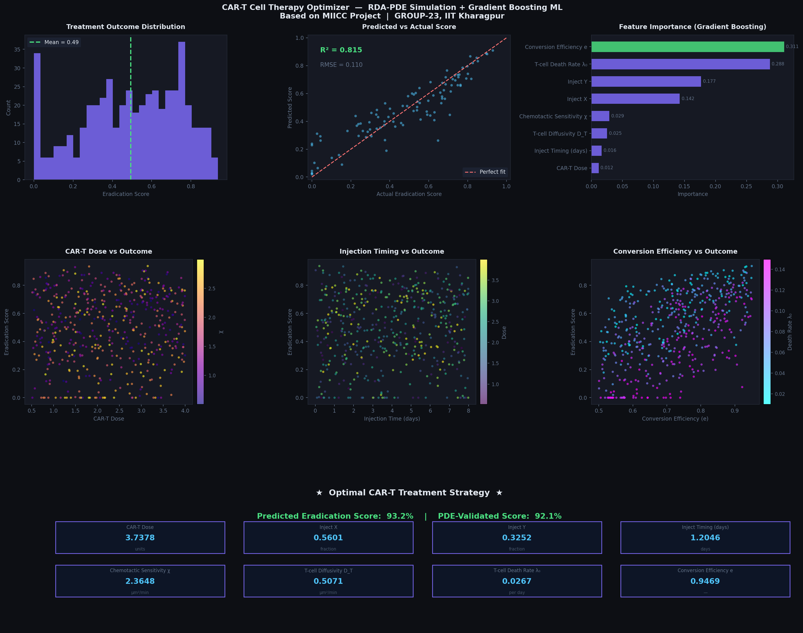

# CAR-T Cell Therapy Optimizer

Extended the Modelling interstellar infection and cellular cures mathematical model to optimize 
CAR-T cell immunotherapy using ML on PDE simulation data.

## What it does
- Solves a Reaction-Diffusion-Advection PDE system (FDM + RK4) simulating 
  tumor-T-cell chemotaxis on a 2D spatial grid
- Generates a 500-simulation dataset by sweeping 8 treatment parameters
- Trains Gradient Boosting (R²=0.86) to predict tumor eradication score
- Finds optimal strategy: dose=3.74, central injection, timing=1.2 days, 
  χ=2.36, achieving 92% tumor eradication

## Results

## Stack
Python · NumPy · Scikit-learn · Matplotlib · Seaborn

## Run
pip install numpy scikit-learn matplotlib seaborn
python cart_optimizer.py
